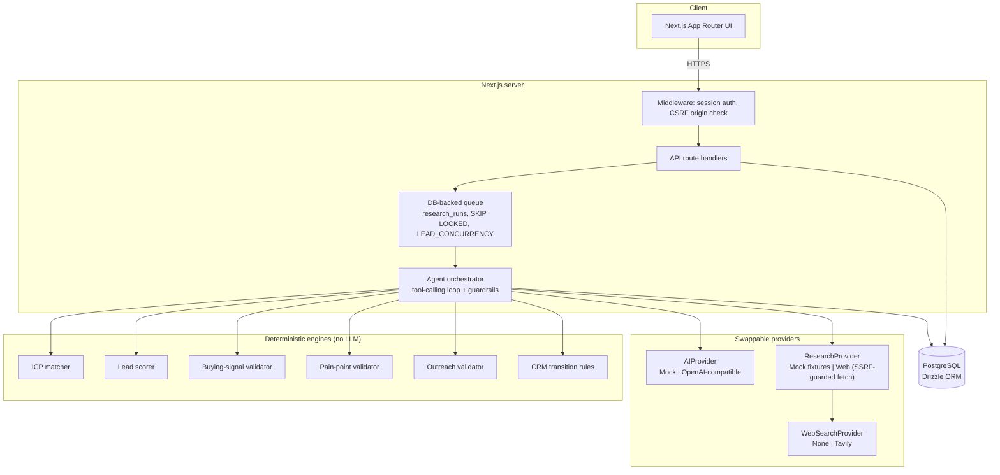

# AI Lead Research & Qualification Agent

An AI-powered lead research and qualification platform built for **NovaFlow AI**, a
fictional automation agency used as the branding for this portfolio project. It turns
a company name into an evidence-backed, sales-ready dossier: research, ICP fit,
buying signals, pain-point hypotheses, automation opportunities, a transparent lead
score, and draft outreach — every claim carrying a source, a confidence, and a label,
and nothing sent to a prospect without a human approving it first.

This is the third project in a portfolio series, following an AI customer support
agent and a WhatsApp AI sales agent. Where those focus on conversation, this one
focuses on **research, evidence and judgment**: it is not a chatbot.

## Overview

Given a company name and optional website/contact, the system:

1. researches the company (mock fixtures or a real, SSRF-guarded website fetch),
2. builds a structured company profile with a source and confidence on every field,
3. scores it against a configurable Ideal Customer Profile (ICP),
4. detects buying signals and forms hedged pain-point hypotheses,
5. maps pain points to NovaFlow automation offerings,
6. computes a transparent, weighted lead score,
7. drafts personalized outreach (cold email, LinkedIn note, two follow-ups),
8. runs every draft through a quality validator, and
9. stops for **human approval** before anything is considered ready to send.

## Problem

Sales teams spend hours opening websites and guessing whether a company is worth
contacting. Lead scores from black-box tools can't be explained to the rep who has
to act on them. Outreach written from thin research reads generic, or worse, states
things nobody actually checked.

## Solution

An agent that researches each company, keeps a source and confidence for every fact,
evaluates it against ICP rules that are deterministic and inspectable, and drafts
outreach that a human reviews before it goes anywhere. Every step is recorded.

## Key features

- **Two intake flows**: a single-lead form, and CSV import (validate → preview →
  commit → queued processing) for up to 500 rows at a time.
- **Evidence-backed research**: every fact carries `source`, `source_url`,
  `confidence` and `retrieved_at`, and one of six labels — Verified, Source-backed,
  Estimated, Inferred, Demo, Potential.
- **Deterministic ICP matching** against industry, size, geography, business
  characteristics and technology signals, with a per-criterion score and reason.
- **Transparent, configurable lead scoring** across nine weighted factors, always
  summing to the total, each with evidence and an explanation.
- **Buying-signal detection** that only keeps signals with evidence, a source and a
  confidence above threshold — no evidence, no signal.
- **Hedged pain-point hypotheses** ("Potential", "Possible", "Indication…") that must
  cite known evidence or are rejected outright.
- **Automation opportunities** mapped from pain points to NovaFlow offerings, with no
  invented ROI figures.
- **Personalized outreach** (cold email, LinkedIn, two follow-ups) validated for
  company name accuracy, personalization, invented metrics, hallucinated
  technologies, unsupported claims, fake familiarity and length — PASS or NEEDS
  REVIEW, with reasons.
- **Human approval workflow**: every draft is marked "AI GENERATED — REQUIRES HUMAN
  APPROVAL" and moves Draft → Review → Approve → (manually) Sent. The AI can never
  send anything, and can never move a lead to Approved, Contacted, Replied, Meeting,
  Won or Lost — those are human-only.
- **CRM pipeline** with 11 stages and full activity history (who did what: human, AI
  or system).
- **Analytics** computed live from PostgreSQL: totals, qualification rate, ICP match
  rate, research success rate, score/industry/stage distributions, and automation
  opportunity counts.
- **Full agent observability**: every tool call is logged with a safe input/output
  summary, status, duration and whether the planner or a deterministic fallback chose
  it. No model chain-of-thought is stored or displayed.

## Architecture



### Request flow for one lead

```mermaid
sequenceDiagram
    participant U as User
    participant API as API route
    participant Q as Queue (research_runs)
    participant A as Agent orchestrator
    participant R as ResearchProvider
    participant AI as AIProvider
    participant DB as PostgreSQL

    U->>API: POST /api/leads/analyze
    API->>DB: create/reuse lead
    API->>Q: enqueue run (status=queued)
    API-->>U: 202 { leadId, runId }
    Q->>A: claim run (FOR UPDATE SKIP LOCKED)
    loop until update_crm
        A->>A: choose next tool (planner or fallback)
        A->>R: research_company / analyze_website
        A->>AI: extract_profile / generate_outreach / summarize_lead
        A->>DB: record tool call (input/output summary, status, duration)
    end
    A->>DB: save report, score, signals, pain points, drafts; move CRM stage
    U->>API: GET /api/runs/:id (polling)
    API-->>U: progress + tool activity
```

## AI agent workflow

The orchestrator (`src/lib/agent/orchestrator.ts`) runs a tool-calling loop over 11
tools (`src/lib/agent/tools.ts`):

`research_company → analyze_website → extract_profile → match_icp →
detect_buying_signals → identify_pain_points → find_automation_opportunities →
calculate_lead_score → generate_outreach → validate_outreach → update_crm`

At each step, only tools whose prerequisites are already done are offered to the AI
provider's `chooseNextTool`. Guardrails then:

- reject a choice that names an unavailable tool and fall back to canonical order,
- validate the chosen tool's arguments with Zod, discarding invalid ones and using
  safe defaults,
- catch a planner exception and fall back rather than aborting the run,
- catch a structured-output failure inside `extract_profile` or `summarize_lead` and
  degrade to the deterministic profile / a template summary instead of failing the
  whole run,
- skip `generate_outreach` cleanly (with a reason) if the AI call fails, if the lead
  isn't qualified, or if there's no evidence to personalize with — never invents a
  reason to proceed.

No model reasoning/chain-of-thought is ever persisted or shown; only tool name, a
safe input/output summary, status and duration.

## Research system

Two interchangeable `ResearchProvider` implementations:

- **Mock** (`AI_PROVIDER=mock`, `RESEARCH_PROVIDER=mock`, the default): six fictional
  companies on reserved `.example` domains, each with a designed ICP/score outcome.
  Every field is forced to the `demo` label — it is never presented as real. For an
  unrecognized company it returns nothing rather than inventing facts.
- **Web** (`RESEARCH_PROVIDER=web`): fetches the homepage and a few same-origin pages
  of interest, respecting `robots.txt`, with:
  - SSRF protection on every hop (`src/lib/security/url.ts`, `safe-fetch.ts`) —
    rejects localhost, private/loopback/link-local/reserved IPv4 and IPv6, the cloud
    metadata address, non-`http(s)` schemes, credentials in the URL, and re-checks
    DNS-resolved addresses (blocks DNS-rebinding to a private IP),
  - a hard timeout and byte cap per request, manual redirect handling capped at 3
    hops with the same SSRF check on every hop,
  - a content-type allow-list (HTML/text only),
  - optional web search (`WEB_SEARCH_PROVIDER=tavily`) whose results are recorded as
    `source_backed` evidence with the source URL.

Every extracted fact goes into an evidence list with `id`, `statement`, an optional
excerpt, and full provenance. Facts the AI infers must cite evidence ids that exist,
or they're rejected.

## ICP matching

`src/lib/engine/icp.ts` — fully deterministic, no LLM involved. Evaluates industry,
company size, geography, business characteristics and technology signals against the
configured `IcpConfig`, each with a weight, and returns a fit score, a match band
(strong/medium/weak/poor/insufficient data), and a reasoned factor for every
criterion. Weights are edited in **ICP & scoring** and must sum to 100.

## Lead scoring

`src/lib/engine/scoring.ts` — nine weighted, deterministic factors (industry fit,
company size fit, geography fit, business complexity, automation need, technology
readiness, buying signals, pain severity, contact relevance), each with its own
evidence and explanation, always summing to the total. Grades A (≥80) / B (≥65) /
C (≥45) / D. A lead is "qualified" only above the configured threshold and only when
there's no `needs_review` flag (e.g. missing core facts).

## Buying signals

`src/lib/engine/buying-signals.ts` accepts a candidate only if it has evidence, a
named source, a confidence ≥ 0.3, and a non-future detection date. Nothing is kept
without evidence.

## Pain-point analysis

`src/lib/engine/pain-points.ts` generates hypotheses from observed operational
signals and buying signals, always hedged ("Potential…", "Possible…"), and the
validator rejects anything citing an evidence id that doesn't exist.

## Automation opportunities

`src/lib/engine/opportunities.ts` maps pain points to a small catalog of NovaFlow
offerings (AI customer support agent, AI lead-qualification agent, CRM automation,
WhatsApp AI support, workflow automation), with a proposed solution, an expected
workflow, and an implementation-complexity estimate — never a dollar figure or a
percentage that wasn't in the evidence.

## Personalized outreach

`src/lib/engine/outreach-validator.ts` checks every draft for: correct company name,
no other company mentioned, contact name usage, at least one reference to real
research, no generic opening, no invented numbers, no technology that wasn't
detected, no unsupported claims, no fake familiarity, tone, subject presence, and a
300-character cap for LinkedIn. Result is PASS or NEEDS REVIEW with itemized reasons.

## Human approval

Every draft is labeled **"AI GENERATED — REQUIRES HUMAN APPROVAL"**. The flow is
Draft → Review → Approve → (human) Sent. A human can edit a draft (which
re-validates it), reject it, or approve a NEEDS REVIEW draft only after explicitly
acknowledging the findings. There is no email integration — "Mark as sent" records
that a human sent it themselves outside the app.

## CRM

11 stages: New, Researching, Qualified, Needs review, Outreach drafted, Approved,
Contacted, Replied, Meeting, Won, Lost. `src/lib/engine/crm.ts` enforces which actor
(AI or human) can make which transition — the AI is limited to
New→Researching→Qualified/Needs review→Outreach drafted; **Approved, Contacted,
Replied, Meeting, Won and Lost are human-only**, and Won/Lost require going through
the normal flow first (no skipping stages).

## CSV import

Upload → validate (every row, with per-row errors, before anything is saved) →
preview valid rows → commit → each valid row becomes/reuses a lead and is queued →
live processing status. Duplicate companies (by name or website domain) are flagged
and never imported twice. Required column: `company`. Optional: `website`,
`contact_name`, `contact_email`, `title`, `industry`, `country` (common aliases are
accepted). Limits: 1&nbsp;MB, 500 rows.

## Analytics

`/analytics` computes everything live from PostgreSQL: totals, leads analyzed,
qualified count, average score, ICP match rate, research success rate, outreach
drafts/approvals, and breakdowns by score band, CRM stage, industry, research
status, outreach status and automation opportunity. No hardcoded figures.

## Security

- Scrypt-hashed passwords, HMAC-signed (Web Crypto) stateless session cookies
  verified in Edge middleware, `httpOnly`/`sameSite=lax` cookies.
- Middleware rejects state-changing requests whose `Origin` doesn't match the host
  (CSRF), and gates every protected page/API route on a valid session.
- Admin-only actions (editing the ICP) are enforced server-side, not just hidden in
  the UI.
- Request body size limits, CSV size/row limits, and a simple per-key rate limiter on
  login, lead analysis and CSV import.
- All the SSRF and fetch protections described under Research system above.
- Errors returned to the client are sanitized (no stack traces, no provider payloads,
  API keys redacted from any error text).

## Mock mode

Default configuration (`AI_PROVIDER=mock`, `RESEARCH_PROVIDER=mock`). Six fictional
demo companies with designed outcomes (strong/medium/poor fit, with and without
buying signals) are seeded and pre-analyzed except **Example Logistics**, which is
left unanalysed so the built-in demo (`/demo`) can run the full pipeline live. Every
mock-derived fact is labeled **Demo**.

## Real provider setup

Set `AI_PROVIDER=openai` and `OPENAI_API_KEY` to use any OpenAI-compatible Chat
Completions endpoint (`OPENAI_BASE_URL`, `OPENAI_MODEL`). Set
`RESEARCH_PROVIDER=web` for live website fetching, and optionally
`WEB_SEARCH_PROVIDER=tavily` with `TAVILY_API_KEY` for web search. See the honesty
note in [Testing status](#testing-status) below — these adapters are implemented and
covered by mocked-HTTP tests, not exercised against the live OpenAI/Tavily APIs in
this repository.

## Installation

```bash
git clone <this-repo>
cd ai-lead-research-agent
npm install
cp .env.example .env      # edit DATABASE_URL, SESSION_SECRET, etc.
```

## Environment variables

See `.env.example` for the full, commented list. The essentials:

| Variable | Purpose |
|---|---|
| `DATABASE_URL` | PostgreSQL connection string |
| `TEST_DATABASE_URL` | Separate database used only by integration tests |
| `SESSION_SECRET` | ≥32 random chars, signs session cookies |
| `SEED_ADMIN_EMAIL` / `SEED_ADMIN_PASSWORD` | Admin account created by `npm run db:seed` |
| `AI_PROVIDER` | `mock` \| `openai` |
| `RESEARCH_PROVIDER` | `mock` \| `web` |
| `WEB_SEARCH_PROVIDER` | `none` \| `tavily` |
| `LEAD_CONCURRENCY` | Max leads processed in parallel |

## Database setup

Requires PostgreSQL. Create the database in `DATABASE_URL`, then:

```bash
npm run db:migrate   # apply drizzle/ migrations
npm run db:seed      # admin user, default ICP, demo companies
```

`npm run db:reset` drops and recreates the schema, then migrates and seeds again
(development use only — refuses to run when `NODE_ENV=production`).

## Running the app

```bash
npm run dev     # http://localhost:3000
# or
npm run build && npm start
```

## Tests

```bash
npm test
```

185 tests across 17 files: ICP engine, lead scoring, research normalization and
provenance, buying signals, pain points and opportunities, outreach validation, CSV
parsing, CRM transitions, authentication and sessions, middleware (auth + CSRF),
agent tool schemas, planner fallback behavior, the mocked OpenAI and Tavily
adapters, SSRF/security, website-fetch behavior (mocked HTTP), API routes, and a
PostgreSQL integration suite (`TEST_DATABASE_URL`, truncated between tests — the
seeded development database is never touched by tests).

## Build

```bash
npx tsc --noEmit   # typecheck
npm run lint       # eslint
npm test           # vitest
npm run build      # next build
```

## Demo

See [`docs/DEMO.md`](docs/DEMO.md) for a full walkthrough. Short version: sign in,
go to **Analyze lead**, pick **Example Logistics**, run the analysis, and watch the
9-step pipeline complete live.

## Testing status

Being precise about what "tested" means here:

| Component | Status |
|---|---|
| Mock AI provider | Verified (unit + integration tests, seed data, live demo run) |
| Mock research provider | Verified |
| PostgreSQL / Drizzle schema | Verified (migrated, seeded, integration-tested) |
| Agent pipeline (11 tools, planner + fallback) | Verified |
| ICP engine | Verified |
| Lead scoring | Verified |
| Buying signals / pain points / opportunities | Verified |
| Outreach generation + validation | Verified |
| Human approval workflow | Verified |
| CRM stage rules | Verified |
| CSV import | Verified |
| Analytics | Verified |
| Authentication / sessions / middleware / CSRF | Verified |
| Website fetcher (SSRF, timeout, size cap, robots.txt) | Verified — plus one **live** fetch against `github.com/about` (see [ARCHITECTURE.md](docs/ARCHITECTURE.md#live-website-fetch-test)) |
| OpenAI-compatible adapter | Implemented, mocked-HTTP tested. **Not tested against the live OpenAI API.** |
| Tavily adapter | Implemented, mocked-HTTP tested. **Not tested against the live Tavily API.** |

## Limitations

- The OpenAI-compatible and Tavily adapters have never been exercised against their
  real APIs in this repository — only mocked HTTP responses.
- The web research provider fetches the homepage plus a few linked pages matching an
  "interesting path" heuristic (about, services, contact, careers, pricing…); it is
  not a general crawler and does not follow pagination or JS-rendered content.
- The rate limiter is in-memory per process — fine for a single-instance demo, not
  for a multi-instance production deployment.
- "Mark as sent" is a manual record, not an email integration; no messages are ever
  sent by the app itself.
- shadcn/ui components are hand-written (cva + tailwind-merge) rather than pulled via
  the shadcn CLI, because this environment has no network access to
  `ui.shadcn.com`; visually and functionally equivalent, but worth noting.
- Analytics and scoring are computed from each lead's *latest completed* run; older
  runs are kept for history but don't affect current figures.

## Future improvements

- A real job queue (e.g. a dedicated worker process) instead of the in-process
  `SKIP LOCKED` polling queue, for multi-instance deployments.
- Persisted, distributed rate limiting.
- A general-purpose crawler mode with a sitemap-aware page discovery step.
- Bulk outreach approval and CSV export of qualified leads.
- Email delivery integration for the outreach step (currently manual-send only, by
  design, to keep a human in the loop).

## Tech stack

Next.js (App Router), React, TypeScript, Tailwind CSS, PostgreSQL, Drizzle ORM,
Zod, OpenAI-compatible Chat Completions (structured outputs + tool calling),
Cheerio, Recharts, Vitest, ESLint

## License

MIT — see [`LICENSE`](LICENSE).

## Repository

`github.com/mehranmls4-arch/ai-lead-research-agent`
