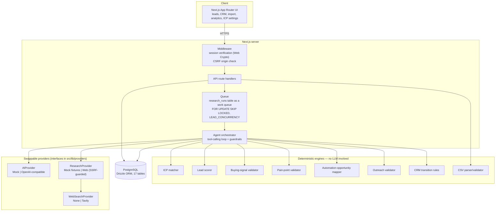

# Architecture

## System overview



## Layering

```
src/
  app/                 Next.js pages and API routes (thin — delegate to lib/services)
  components/          UI (provenance badges, status badges, lead sections, charts...)
  lib/
    domain/            Zod schemas: the shape of a lead, a profile, provenance, signals
    engine/            Pure, deterministic business logic (ICP, scoring, validators, CRM rules, CSV)
    providers/         Swappable AI / research / search implementations behind interfaces
    agent/             The tool-calling orchestrator and the 11 tool definitions
    services/          Application services: leads, queue, outreach, imports, analytics, queries
    db/                Drizzle schema and client
    security/          URL/SSRF validation, safe fetch, robots.txt, rate limiting
    auth/              Password hashing, session signing/verification
```

The design goal: **anything that must be explainable or auditable is deterministic
code, not a model call.** The LLM (or its mock stand-in) is used only for three
narrow tasks — filling profile fields the deterministic pass couldn't (with
mandatory evidence citations), drafting outreach text, and writing a plain-language
summary — and every one of those outputs still passes through a deterministic
validator before it's trusted.

## The agent loop

`src/lib/agent/orchestrator.ts` implements `runAgent(lead, deps)`:

1. Compute the set of tools whose `requires` are already satisfied.
2. Ask `deps.ai.chooseNextTool(...)` which one to run next, passing only a safe
   summary of progress so far (never raw evidence or PII beyond what's needed).
3. **Guardrails**, applied regardless of what the model says:
   - If the call throws, or names a tool that isn't currently available, or returns
     nothing, fall back to the tools in their canonical dependency order.
   - Validate the returned arguments against the tool's Zod schema; on failure, run
     the tool with safe defaults instead of trusting unvalidated input.
4. Record the tool call (`recorder.toolStarted` / `toolFinished`) with a status,
   duration, and a short, safe input/output summary — never the model's reasoning.
5. Run the tool. Tools that call an AI provider for text generation
   (`extract_profile`, `generate_outreach`, `summarize_lead`) catch a provider
   failure and **degrade rather than abort**: `extract_profile` falls back to the
   deterministic, evidence-only profile; `summarize_lead` falls back to a
   deterministic template built from the same values; `generate_outreach` skips with
   a clear reason so the run still reaches `update_crm`.
6. Repeat until `update_crm` runs or the step budget is exhausted.

This means a broken or misbehaving AI provider degrades the *quality* of a run
(fewer inferred fields, a templated summary, outreach skipped) but never crashes the
pipeline or leaves a lead stuck.

## Data model

17 tables (see `src/lib/db/schema.ts`): `users`, `companies`, `contacts`,
`campaigns`, `campaign_leads`, `import_batches`, `leads`, `research_runs`,
`agent_runs`, `tool_calls`, `research_reports`, `qualifications`, `lead_scores`,
`buying_signals`, `pain_points`, `automation_opportunities`, `outreach_drafts`,
`lead_activities`, `icp_configs`. One `lead` per `company` (unique constraint);
re-analysis creates a new `research_run` and, on success, updates the lead's
`latest_run_id` so the UI always reflects the latest completed results while older
runs remain for history.

## The queue

There's no separate worker process. `research_runs` rows double as a lightweight
work queue: `enqueueRun` inserts a `queued` row, and `kickQueue`/`processQueueUntilIdle`
claim rows with `UPDATE ... WHERE id = (SELECT ... FOR UPDATE SKIP LOCKED LIMIT 1)`,
capped at `LEAD_CONCURRENCY` concurrent runs per process, with stale-run recovery for
runs interrupted by a restart. This is intentionally simple and appropriate for a
single-instance deployment; see **Limitations** in the README for what a
multi-instance version would need instead.

## Provenance model

Every fact the system produces carries a `Provenance` object:
`{ source_type, source, source_url, confidence, retrieved_at, label }`. The label is
one of `verified | source_backed | estimated | inferred | demo | potential`, and demo
data is *forced* to the `demo` label regardless of what a provider claims — a mock
provider cannot mislabel itself as real research.

## Security posture

- **SSRF**: `src/lib/security/url.ts` blocks internal hostnames, private/loopback/
  link-local/reserved IPv4 and IPv6 (including `::ffff:`-mapped addresses), the cloud
  metadata address, non-`http(s)` schemes, credentials-in-URL, and non-standard
  ports. `assertPublicUrl` additionally resolves DNS and re-checks the resolved
  address, blocking DNS-rebinding attacks against a hostname that only becomes
  private after resolution. `safeFetch` re-applies this check on every redirect hop
  (capped at 3), enforces a timeout and a byte cap, and only accepts `text/html` /
  `text/plain` content types.
- **AuthN**: scrypt password hashing; stateless session tokens signed with HMAC-SHA256
  over Web Crypto (works identically in Edge middleware and Node route handlers) with
  a 12-hour TTL.
- **AuthZ**: role checks (`admin` required to edit the ICP) enforced in the API route,
  not just hidden in the UI.
- **CSRF**: middleware rejects any non-GET/HEAD/OPTIONS request whose `Origin` header
  doesn't match the request's `Host`.
- **Input limits**: JSON body size cap, CSV size (1&nbsp;MB) and row (500) caps, and a
  simple fixed-window rate limiter on login, lead analysis and CSV import.
- **Error hygiene**: the shared `handle()` wrapper never leaks stack traces or raw
  provider payloads to the client; any accidental API-key-shaped substring in an
  error message is redacted.

### Live website-fetch test

As part of final validation, the `WebResearchProvider` was run against a real,
public page — `https://github.com/about` — the only external host reachable from
this build environment's network policy. It correctly followed `robots.txt`, fetched
the homepage plus one other same-origin page matching the "interesting path"
heuristic, extracted a real title/headings/text sample, and completed in under a
second, well inside the configured timeout and byte-cap limits. (An earlier version
of the page-discovery logic could re-fetch the same URL if it linked to itself under
a matching path, e.g. an "About" page containing an "About" link back to itself;
this was found during this live test and fixed by excluding the root page's own path
from crawl candidates.) This is the only live external integration test performed —
see the README's "Testing status" table for what remains mocked-only.

## Provider abstraction

Three provider interfaces (`AIProvider`, `ResearchProvider`, `WebSearchProvider`)
each have a mock and a real implementation, selected by `AI_PROVIDER`,
`RESEARCH_PROVIDER` and `WEB_SEARCH_PROVIDER`. The agent, the engines, and every UI
component work identically regardless of which implementation is active — the only
visible difference is the `demo` provenance label and a `DemoBadge` in the UI.
